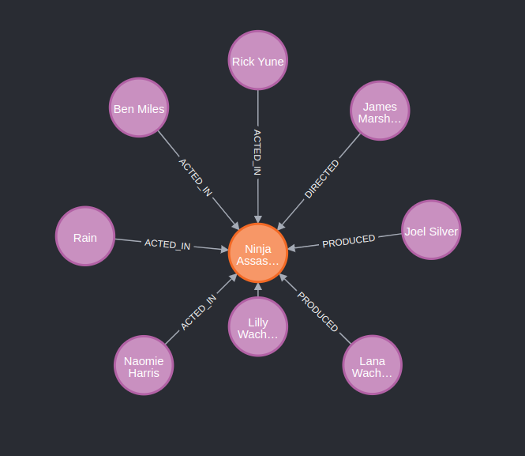
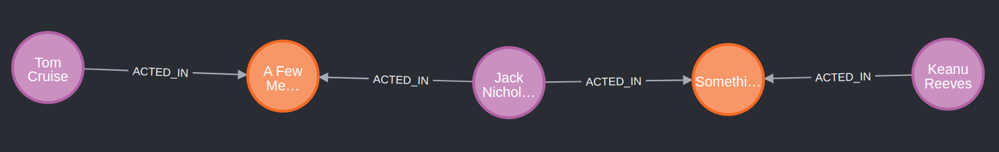

// NMEC: 108712

# 1 Encontre todos os atores que dirigiram um filme em que também atuaram e apresente o nome do ator e o título do filme.

MATCH (other)-[:DIRECTED]->(m)<-[:ACTED_IN]-(other)
RETURN DISTINCT other, m

# 2. Para cada filme realizado depois de 2005, apresente os nomes de todos os atores que atuaram nesse filme.

MATCH (other)-[:ACTED_IN]->(m)
WHERE m.released > 2005
RETURN DISTINCT m.title, collect(other.name)

# 3. Encontre pares de nós com mais do que uma relação entre si.

MATCH (n1)-[c]-(n2)
WITH n1, n2, count(c) as a
WHERE a > 1
RETURN n1, n2

# 4. Encontre todos os pares de pessoas que fizeram revisões do mesmo filme. Apresente os seus nomes e título de cada filme.

MATCH (person:Person)-[:REVIEWED]-(movie:Movie)-[:REVIEWED]-(person2:Person)
RETURN DISTINCT movie.title, person.name, person2.name

# 5. Encontre todos os pares de atores que atuaram em vários filmes juntos.

MATCH (p1:Person)-[:ACTED_IN]-(m:Movie)-[:ACTED_IN]-(p2:Person)
RETURN DISTINCT m.title, p1.name, p2.name

# 6. Determine a idade média do elenco do filme "Apollo 13" no ano do lançamento do filme.

MATCH (person:Person)-[:ACTED_IN]->(movie:Movie)
WHERE movie.title = "Apollo 13"
RETURN round(2023 - avg(person.born))

# 7. Encontre os 10 filmes com o elenco mais velho no momento do lançamento do filme. Apresente o filme e a idade média arredondada a 2 casas decimais, por ordem decrescente.

MATCH (person:Person)-[:ACTED_IN]->(movie:Movie)
RETURN movie.title, round(2023 - avg(person.born), 2)
ORDER BY round(2023 - avg(person.born), 2) DESC
LIMIT 10

# 8. Apresente o subgrafo ACTED_IN do filme com o elenco mais novo, no momento do lançamento do filme.

MATCH (person:Person)-[:ACTED_IN]->(movie:Movie)
RETURN movie, round(2023 - avg(person.born), 2)
ORDER BY round(2023 - avg(person.born), 2)
LIMIT 1

# 9. Qual é o caminho mais curto (usando qualquer tipo de relação) entre John Cusack e Demi Moore?

MATCH
(p1:Person {name: 'John Cusack'}),
(p2:Person {name: 'Demi Moore'}),
p = shortestPath((p1)-[*]-(p2))
WHERE length(p) > 1
RETURN p

# 10. Qual a dimensão caminho mais curto (usando qualquer tipo de relação) entre Keanu Reeves e Tom Cruise?

MATCH
(p1:Person {name: 'Keanu Reeves'}),
(p2:Person {name: 'Tom Cruise'}),
p = shortestPath((p1)-[*]-(p2))
WHERE length(p) > 1
RETURN p

5 nós, 4 e relações.

# 11. Quais são as dimensões do caminho mais curto entre pessoas com nome Jim e pessoas com nome Kevin?

# 12. Que pessoas têm uma distância 2 para Jim Cash (a distância entre duas pessoas é o comprimento do caminho mais curto entre eles)?

# 13. Qual é a maior distância de uma pessoa para Kevin Bacon?

# 14. Qual é a maior distância entre duas pessoas?

# 15. Qual é a distribuição de distâncias em pares (isto é, para a distância 1, 2, 3, ..., quantos pares de pessoas têm essa distância um do outro)?

# 16. Indique as 10 pessoas com menor distância média em que o caminho entre elas são relações do tipo ACTED_IN.

# 17. Apresente os atores que tiveram pelo menos uma role para personagens com o prefixo 'Dr.'. O resultado deve ser uma lista com o par “Ator, Lista das roles”.

# 18.

# 19.

# 20.
